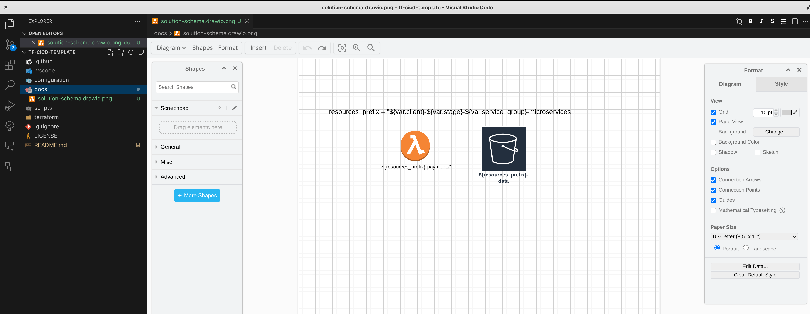
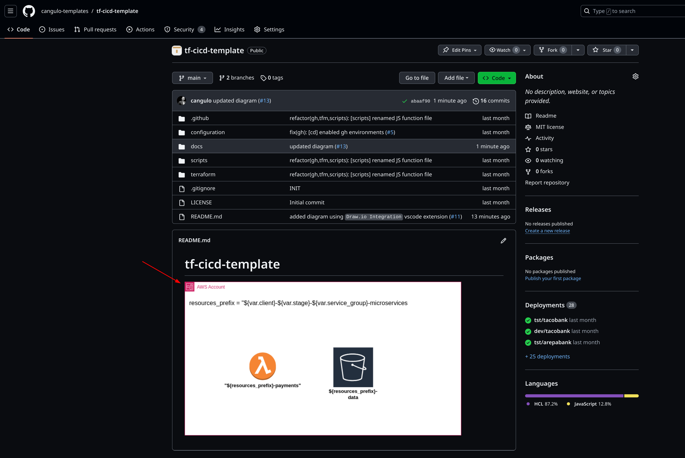
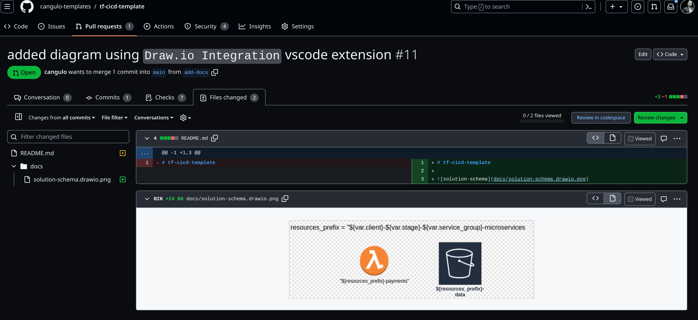
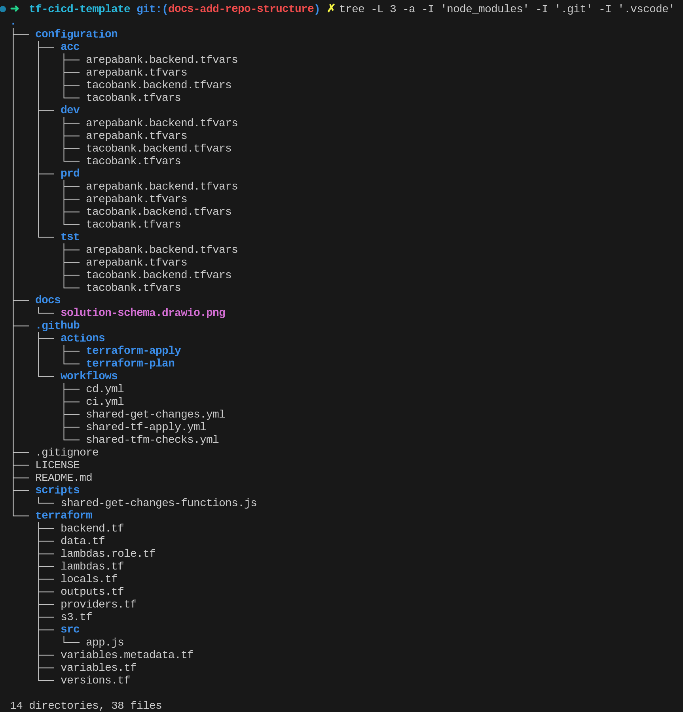
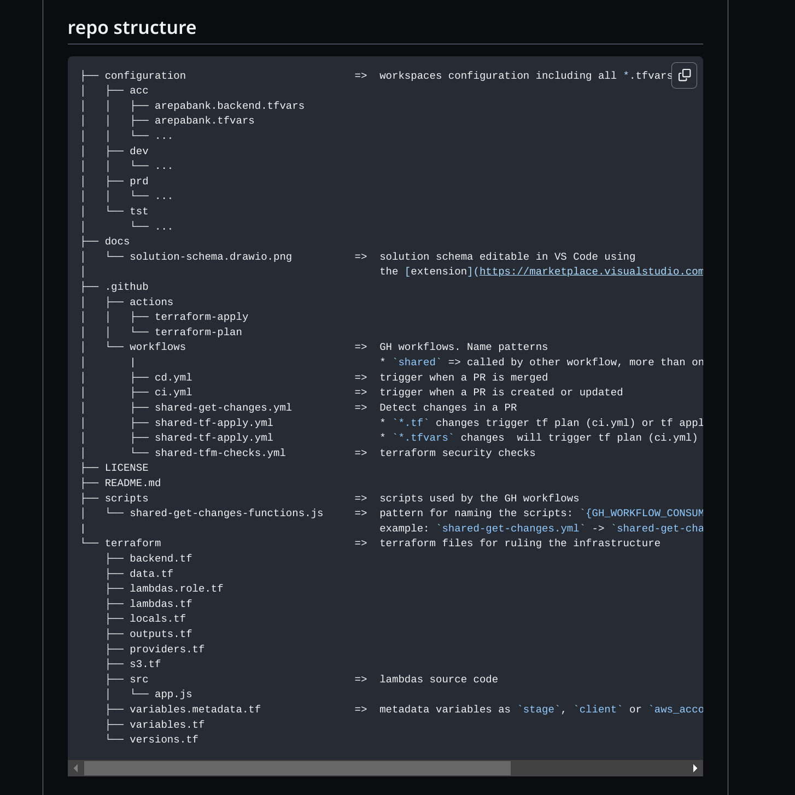

import BrowserWindow from '/src/components/BrowserWindow'
import Tabs from '@theme/Tabs'
import TabItem from '@theme/TabItem'

This post contains list all the tools and templates I use for documenting projects:

1. Incidents / postmortem templates
2. Architectural Decision Record [ADR](https://docs.aws.amazon.com/prescriptive-guidance/latest/architectural-decision-records/adr-process.html)
3. VS Code extensions
4. Shell Scripts: bash and powershell

<!--truncate-->

## 1. Incidents / postmortem templates

## 2. Architectural Decision Record [ADR](https://docs.aws.amazon.com/prescriptive-guidance/latest/architectural-decision-records/adr-process.html)

## 3. VS Code extensions

| Function        | Extension                                  | Tip                                                                     | Link for installing it                                                           |
| --------------- | ------------------------------------------ | ----------------------------------------------------------------------- | -------------------------------------------------------------------------------- |
| Create Diagrams | [Draw.io Integration](#drawio-integration) | You can save diagrams as draw.io.png so they are visible in the readme! | [link](https://marketplace.visualstudio.com/items?itemName=hediet.vscode-drawio) |


### draw.io-integration

I use this extension to manipulate Diagrams in VS code and make them visible in the README.md. Next are creenshots:

#### Editing Diagrams



<CaptionDocusaurus label="Extension Link" linkIsRelative={false}  link="https://marketplace.visualstudio.com/items?itemName=hediet.vscode-drawio" />

#### Diagram visualization in the README



<CaptionDocusaurus label="Readme" linkIsRelative={false}  link="https://github.com/cangulo-templates/tf-cicd-template" />

README.md content: 

```markdown
# tf-cicd-template


```

#### Diagram changes visualization in PR



<CaptionDocusaurus label="PR adding the diagram" linkIsRelative={false}  link="https://github.com/cangulo-templates/tf-cicd-template/pull/11/files" />

<CaptionDocusaurus label="PR editting the diagram" linkIsRelative={false}  link="https://github.com/cangulo-templates/tf-cicd-template/pull/13/files" />


## 4. Shell Scripts: bash and powershell


| Script                                                      | Description                           | When to use                                        |
| ----------------------------------------------------------- | ------------------------------------- | -------------------------------------------------- |
| [output repository structure](#output-repository-structure) | List directory content in tree format | Document the repository structure in the README.md |


### output repository structure

<BrowserWindow>
<Tabs>
  <TabItem value="sh" label="Bash" default>


1. Install `tree` command
2. Execute the command. Next are some useful parameters:
   1. `-L {LIMIT}` option  to limit the display to `{LIMIT}` levels of depth.
   2. `-a` parameter to list all hiddin files (they start with `.`) We need this to list files GH workflows files `.github/workflow/*`
   3. The `-I '{FOLDER_TO_IGNORE}/'` option tells `tree` to ignore files under `{FOLDER_TO_IGNORE}`.
   4. `> repo-structure.txt` to store the output, edit its content and paste it into your README.md


```bash
sudo apt-get install tree
```

```bash
tree -L 3 -a -I 'node_modules' -I '.git' -I '.vscode'  > repo-structure.txt 
```

<details>
  <summary>Output Example</summary>



</details>

  </TabItem>
  <TabItem value="ps" label="PowerShell">

```powershell
Tree /F > repo-structure.txt 
```

  </TabItem>
</Tabs>
</BrowserWindow>

#### Examples:

* [REARDME.md wih repo-structure](https://github.com/cangulo-templates/tf-cicd-template#repo-structure)
* [PR adding repo-structure](https://github.com/cangulo-templates/tf-cicd-template/pull/14/files)


