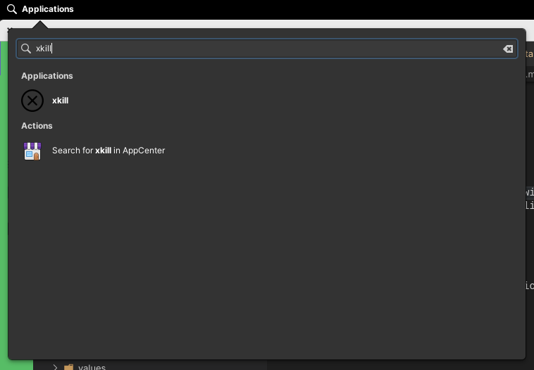

import BrowserWindow from '/src/components/BrowserWindow'
import Tabs from '@theme/Tabs'
import TabItem from '@theme/TabItem'

This post explains some tips I discovered about the Elementary OS.

<!--truncate-->

## Where the app launcher apps are stored?

* `/home/YOUR_USER/.local/share/applications`
* `~/.local/share/applications`

## How does an app launcher looks like:

Outlook shortcut example
```bash
#!/usr/bin/env xdg-open
[Desktop Entry]
Version=1.0
Terminal=false
Type=Application
Name=Outlook
Exec=/opt/vivaldi/vivaldi --profile-directory=Default --app-id=eigpmdhekjlgjgcppnanaanbdmnlnagl
Icon=vivaldi-eigpmdhekjlgjgcppnanaanbdmnlnagl-Default
StartupWMClass=crx_eigpmdhekjlgjgcppnanaanbdmnlnagl
Actions=New-event;New-message;Open-calendar

[Desktop Action New-event]
Name=New event
Exec=/opt/vivaldi/vivaldi --profile-directory=Default --app-id=eigpmdhekjlgjgcppnanaanbdmnlnagl --app-launch-url-for-shortcuts-menu-item=https://outlook.live.com/calendar/deeplink/compose

[Desktop Action New-message]
Name=New message
Exec=/opt/vivaldi/vivaldi --profile-directory=Default --app-id=eigpmdhekjlgjgcppnanaanbdmnlnagl --app-launch-url-for-shortcuts-menu-item=https://outlook.live.com/mail/deeplink/compose

[Desktop Action Open-calendar]
Name=Open calendar
Exec=/opt/vivaldi/vivaldi --profile-directory=Default --app-id=eigpmdhekjlgjgcppnanaanbdmnlnagl --app-launch-url-for-shortcuts-menu-item=https://outlook.live.com/calendar
```

## Nice tip: add xkill as shortcut:

First of all, what `xkill` is? It is a command to _kill_ process by clicking on their windows. The normal usage is:
1. Open a terminal
2. Set the app you want to kill visible next to the terminal
3. Introduce the xkill command in the terminal
4. The mouse pointer will change to an `x`, click on the app windows to kil it. If you want to cancel the operation, right click anywhere

[More details about xkill](https://www.tutorialspoint.com/how-to-kill-linux-processes-using-xkill-command)

Next is an app launcher example;

 ```bash
#!/usr/bin/env xdg-open
[Desktop Entry]
Name=xkill
GenericName=Bash Command Execution
Exec=xkill
Comment=Execute xkill command, you will be able to close any windows by clicking on it
Icon=/home/cangulo/.local/share/applications/icons/xkill-icon.svg
Type=Application
Categories=System
Keywords=Command;kill;close
```

Please note you have to provide an icon, in my case, I created a folder called icons and add the next one:

