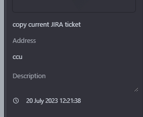
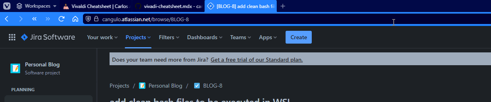

This post explains the next topics:
* some tips for using [Vivalid Web Browser](https://vivaldi.com) as creating macros, bookmarklets and shortcuts

<!--truncate-->

## How to create a bookmarklets that copy JIRA tickets from the url

target JIRA urls: https://cangulo.atlassian.net/browse/BLOG-8

1. Go to bookmarks
2. Create a new one
3. In the url part, **paste but do not save** the next code


```javascript
javascript:(function() {
  var url = window.location.href;
  var pattern = /\/browse\/([^\/]+)/;
  var match = pattern.exec(url);
  var key = match ? match[1] : null;
  if (key) {
    var tempInput = document.createElement('input');
    document.body.appendChild(tempInput);
    tempInput.value = key;
    tempInput.select();
    document.execCommand('copy');
    document.body.removeChild(tempInput);
    alert('Key copied: ' + key);
    location.reload();
  } else {
    alert('No key found in the URL.');
    location.reload();
  }
})();
```
> Code generate using ChatGPT. Request: give me a  Bookmarklets for Vivaldi Web Browser which copy current url

4. Navigate to the begining, the `javascript` part was deleted, type a space and rewrite `javascript`



5. add a nickname so it is easy to call, in my case ccu (copy current url)
6. Test it



## References

* [Strange behavior for bookmarklets](https://forum.vivaldi.net/topic/84388/strange-behavior-for-bookmarklets)
* [Guide | Useful Bookmarklets](https://forum.vivaldi.net/topic/54337/guide-useful-bookmarklets)
