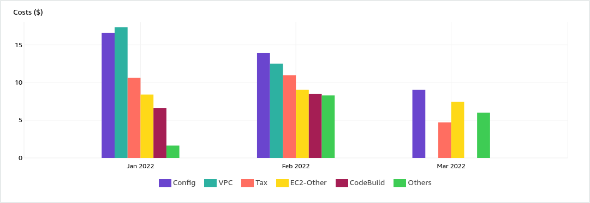
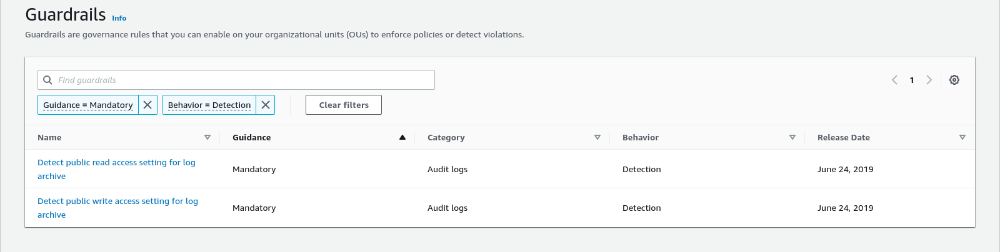
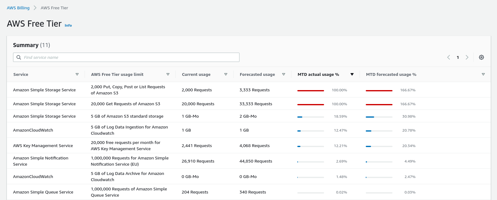

:::info
In this post I'm going to talk about the costs I faced using AWS Control Tower the latest 3 months. I recommend you read my [previous posts](../setup-aws-account-envs/aws-control-tower-aft.mdx) before continuing. Basic knowledge about AWS Control Tower is required.
:::

<!--truncate-->

:::caution

This post is not finished yet

:::

## Context

In my [last post](../setup-aws-account-envs/aws-control-tower-aft.mdx) I explained how I setup the AWS Control Tower services with the Account Factory for Terraform (AFT) approach. Now I'm going to talk about the costs associated.

### Latest 3 months costs:

Before continuing I have to mention my usage of AFT:
* I only used it during January and February. I created 5 AWS Accounts.
* On March I didn't create or enroll any account. This was on purpose to check what are the fixed costs of having AFT inactive, I knew some Control Tower policies created have fixed costs no matter if you use them or not. I will dive into it in the next sections.

And here we have the costs:

| Service  | Config($) | VPC($) | Tax($) | EC2-Other($) | CodeBuild($) | KMS($) | Lambda($) | S3($) | DynamoDB($) | Backup($) | EC2-Instances($) | CloudWatch($) | Total cost ($) |
| -------- | --------: | -----: | -----: | -----------: | -----------: | -----: | --------: | ----: | ----------: | --------: | ---------------: | ------------: | -------------: |
| January  |     16.58 |  17.34 |  10.62 |         8.41 |         6.62 |   1.56 |      0.09 |  0.01 |        0.01 |      0.01 |             0.01 |          0.01 |           61.2 |
| February |      13.9 |   12.5 |  10.98 |         9.04 |          8.5 |   1.87 |      6.44 |  0.01 |        0.01 |      0.01 |             0.01 |          0.01 |          63.22 |
| March    |      9.03 |      0 |   4.72 |         7.44 |            0 |      6 |         0 |  0.01 |        0.01 |      0.01 |                0 |             0 |          27.19 |

:::info
Let's ignore the `Tax` from the plot and table.
:::

### Detailed cost: Services, API Operations and Usages Type

Let me write down the services used:
* AWS Config:
  * API Operation: `None` 
  * Usage Type: `EU-ConfigurationItemRecorded`
* VPC: 
  * API Operation: `VpcEndpoint` 
  * Usage Type: `EU-VpcEndpoint-Hours`
* EC2-Other:
  * API Operations: `NatGateway`, `AssociateAddressVPC`, here are the costs:
  * Usage Type: `EU-NatGateway-Hours`,`EU-ElasticIP:IdleAddress`, `EU-NatGateway-Bytes`

| API Operation | NatGateway($) | AssociateAddressVPC($) | Total |
| ------------- | ------------: | ---------------------: | ----: |
| January       |          7.28 |                   1.13 |  8.41 |
| February      |          7.02 |                   2.02 |  9.04 |
| March         |             0 |                   7.44 |  7.44 |

| Usage Type | EU-NatGateway-Hours($) | EU-ElasticIP:IdleAddress($) | EU-NatGateway-Bytes($) |
| ---------- | ---------------------: | --------------------------: | ---------------------: |
| January    |                    7.2 |                       1.123 |           0.0793064235 |
| February   |                   6.24 |                       2.019 |           0.7722825486 |
| March      |                        |                       7.435 |                        |

* CodeBuild: 
  * API Operation: `Build`
  * Usage Type: `EU-Build-Min:Linux:g1.medium` (January), `EU-Build-Min:Linux:g1.small` (February). Each usage type is defined [here](https://aws.amazon.com/es/codebuild/pricing/) and it might from one month to another because a [release on the original github](https://github.com/aws-ia/terraform-aws-control_tower_account_factory/releases) that I forked.
* Key Management Service:
  * API Operation: `Unknown`
  * Usage Type: `eu-west-1-KMS-Keys`,`eu-west-2-KMS-Keys`

| Usage Type | eu-west-1-KMS-Keys($) | eu-west-2-KMS-Keys($) | Total |
| ---------- | --------------------: | --------------------: | ----: |
| January    |                  1.06 |                   0.5 |  1.56 |
| February   |                  1.24 |                  0.63 |  1.87 |
| March      |                     4 |                     2 |     6 |

* Lambda:
  * API Operation: `Invoke`
  * Usage Type: `EU-Lambda-GB-Second`

### Analysis

* The only services that still cost without usage are:
  * AWS Config
  * EC2-Other
  * KMS
* AWS Config is the highest cost. I wrote a dedicate section for this service: [aws config section](#aws-config)
* There are no cost for  the services `CodeBuild` and  `Lambda`. This is because I haven't created nor enrolled any account in March.
* Using the improvement to disable the VPC endpoints and NAT explained in my [previous posts](../setup-aws-account-envs/aws-control-tower-aft.mdx), in March the cost is 0 for the following operations:
  * `EU-VpcEndpoint-Hours` - service `VPC`
  * `EU-NatGateway-Hours` and `EU-NatGateway-Bytes` - service `EC2-Other`
* However, **there is still a cost in the `EC2-Other`** service, it is for the API Operation `AssociateAddressVPC` , usage type: `EU-ElasticIP:IdleAddress`. 
* The **KMS cost has increase in March**. I didn't expect this one because I didn't use AFT during that month.
* Other services ( `S3` ,`DynamoDB` ,`Backup` ,`EC2-Instances` ,`CloudWatch` ) have no cost or less than 0.10.

### Questions

* Can I reduce the AWS Config cost ? 
* What does the operation `EU-ElasticIP:IdleAddress` do? How can I decrease this cost? 
* Why KMS cost increase in March if I didn't use AFT? How can I decrease it?

## Can I reduce the AWS Config cost ? 

AWS Config is a AWS service that allow us to record and evaluate resources configurations. You can check the full description [here](https://aws.amazon.com/config/?nc1=h_ls). 
This service is been used by the AWS Control Tower as described next:

AWS Control Tower has a feature named [Guardrails](https://docs.aws.amazon.com/controltower/latest/userguide/guardrails.html), those are rules validated against resources created in enrolled accounts. This provides governance to AWS environments. 
Those Guardrails can be preventive (ensuring your account maintain compliance) or Detective (detect noncompliance resources) based on the behavior. 
The detective guardrails are implemented using AWS Config rules. 
This means Control Tower call AWS Config to validate the configuration of the resources when a detective guardrails is active.

okey, too much theory, the most importance, next are the two detective guardrails activated by default in a landing zone:

Action done: 
1. create a OU named not enrolled accounts
2. Move the AFT account that has all the resources there
3. Check it is not enrolled
4. Open the AWS Config and stop recording
5. move the AFT account from the OU that was in the landing zone to another one

## What does the operation `EU-ElasticIP:IdleAddress` do? How can I decrease this cost? 

I discover I had two Elastic IP addresses not linked to any EC2 instances, this is why it is been charged in Idle state. I release them so no more cost is generated. More details about why it was been charge [here](https://aws.amazon.com/premiumsupport/knowledge-center/elastic-ip-charges/).

## KMS Costs

:::info
I will answer this one in my next post. Too much for this one.
:::

## Side Notes: 

### Wait Carlos, were you using the Free Tier?

Yes, I was, and that might reduce the final costs I had, but I don't expect them to be significantly different nor to change any conclusion of this article. 

Next is my remaining Free Tier quota on April 18, as you see some services already exceeded the free layer though I haven't used the AFT resources since later February. 

### Audit and Log AWS Accounts costs

For using AWS Control Tower there are 3 accounts required:
* Audit Account.
* Log Archive Account.
* AFT Account where all the resources to process account creation request are.

Next are the costs per account

| Linked Account Name | cangulo_aft ($) | Log Archive ($) | Audit ($) |
| ------------------- | --------------- | --------------- | --------- |
| January             | 61.2            | 1.8             | 0.2       |
| February            | 63.3            | 1.5             | 0.02      |
| March               | 27.2            | 2.8             | 0.01      |

:::info

In this post I'm only referring to the AFT account costs. 

:::

## References:

* [Starting with Control Tower](https://docs.aws.amazon.com/controltower/latest/userguide/getting-started-with-control-tower.html)
  * `If you are running ephemeral workloads from accounts in AWS Control Tower, you may see an increase in costs associated with AWS Config. Contact your AWS account representative for more specific information about managing these costs.`
* [control tower user guide](https://docs.aws.amazon.com/controltower/latest/userguide/guardrails.html)
  * `The detective guardrails are implemented using AWS Config rules`
* 

### Git Repositories

[learn-terraform-aft-account-provisioning-customizations](https://github.com/hashicorp/learn-terraform-aft-account-provisioning-customizations)  
[learn-terraform-aft-account-customizations](https://github.com/hashicorp/learn-terraform-aft-account-customizations)  
[learn-terraform-aft-global-customizations](https://github.com/hashicorp/learn-terraform-aft-global-customizations)  
[learn-terraform-aft-account-request](https://github.com/hashicorp/learn-terraform-aft-account-request)  