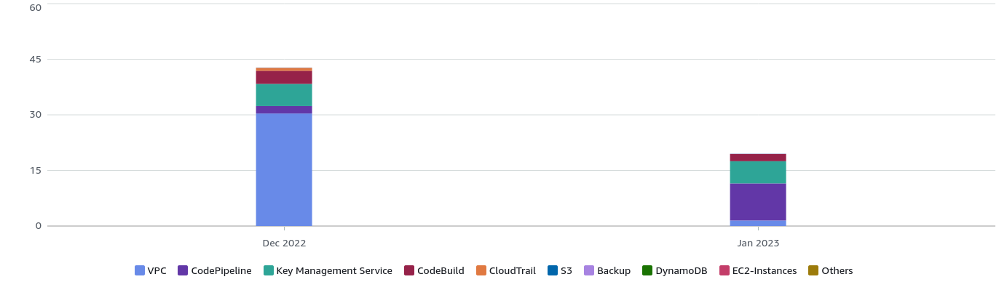
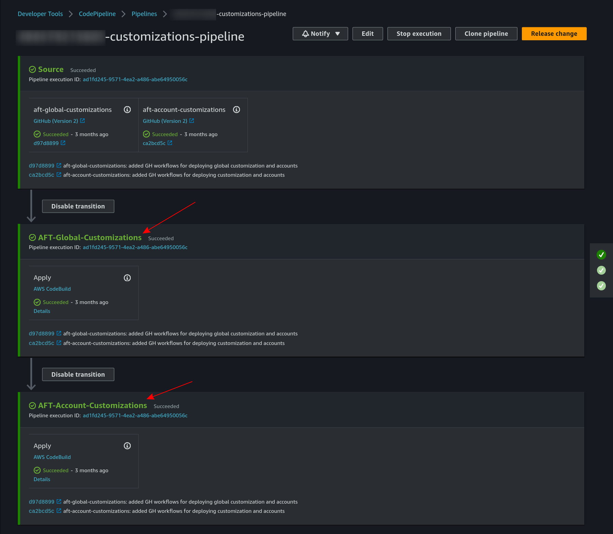
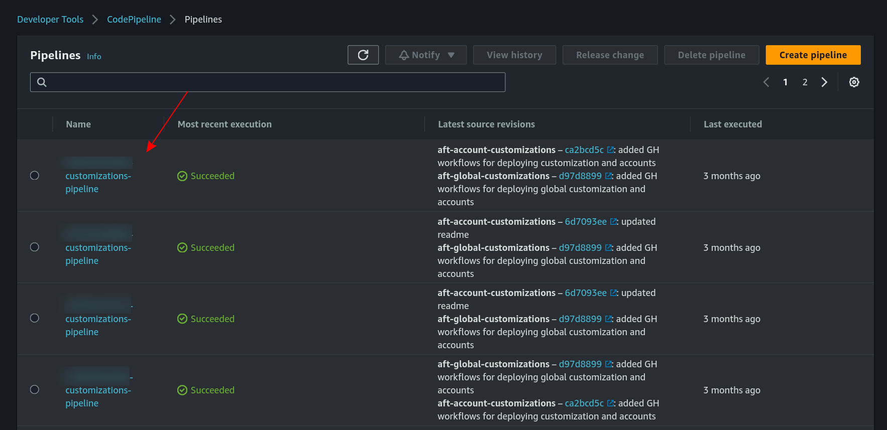

:::info
In this post I'm going to explain how I migrate the Control Tower AFT CodePipelines to GitHub workflows. 
:::

<!--truncate-->

## wait, why? 

Simply, saving costs. Next are the monthly costs for updating 12 AWS accounts. 




| Service                      | Service total | December 2022 | January 2023 |
| ---------------------------- | ------------- | ------------- | ------------ |
| VPC costs                    | $31.86        | $30.36        | $1.50        |
| CodePipeline costs           | $12.00        | $2.00         | $10.00       |
| Key Management Service costs | $11.98        | $5.99         | $5.99        |
| CodeBuild costs              | $5.49         | $3.54         | $1.95        |

* VPC Costs: I described in my previous post how to reduce it through a custom flag.
* Code Pipeline and Codebuild costs: The main cost here is related to pipelines executions. We will dive into in the next section.
* KMS: Control Tower for AFT Cost for using the secrets created with Control Tower AFT


### Pipelines


Account customization has two type: 
* aft-global-customization in the repository [learn-terraform-aft-account-customizations](https://github.com/hashicorp/learn-terraform-aft-account-customizations)  
* aft-account-customization in the repository [learn-terraform-aft-global-customizations](https://github.com/hashicorp/learn-terraform-aft-global-customizations)  

Both are in the same CodePipeline model `{ACCOUNT_ID}-customizations-pipeline`:



There is one pipeline replica for each AWS account:



So, for updating all the accounts, all the pipelines should be executed. 

### Migrating to GH workflows

Let me first set the scope: I want to reduce the CodePipeline cost by executing GH workflows instead. 

My initial approach is to create GH workflows in the `global-customization` and `account-customization` repositories to apply customizations to any account. This will work for created account, but if I create a new one that will still go through the CodePipeline. 

Okey, let's start:

First, let me list the pipelines specs:
* [aft-account-customizations](https://github.com/aws-ia/terraform-aws-control_tower_account_factory/blob/60ee77b6a90e4bc6a96a60c8d8105d71ba5d3543/modules/aft-customizations/buildspecs/aft-account-customizations-terraform.yml)
* [aft-global-customizations](https://github.com/aws-ia/terraform-aws-control_tower_account_factory/blob/60ee77b6a90e4bc6a96a60c8d8105d71ba5d3543/modules/aft-customizations/buildspecs/aft-global-customizations-terraform.yml)

Both share a common structure:
* [install](https://github.com/aws-ia/terraform-aws-control_tower_account_factory/blob/60ee77b6a90e4bc6a96a60c8d8105d71ba5d3543/modules/aft-customizations/buildspecs/aft-global-customizations-terraform.yml#L7): setup the environment variables for the execution and install the dependencies
* [pre_build](https://github.com/aws-ia/terraform-aws-control_tower_account_factory/blob/60ee77b6a90e4bc6a96a60c8d8105d71ba5d3543/modules/aft-customizations/buildspecs/aft-global-customizations-terraform.yml#L63): execute a python script
* [build](https://github.com/aws-ia/terraform-aws-control_tower_account_factory/blob/60ee77b6a90e4bc6a96a60c8d8105d71ba5d3543/modules/aft-customizations/buildspecs/aft-global-customizations-terraform.yml#L71):  
  * build `backend.tf` and `aft-providers.tf` from the templates `backend.jinja` and `aft-providers.jinja`. jinja is language that combined with python simplify files templates filling, in this case, help us build those terraform files dynamically for each account.
  * terraform init
  * terraform apply
* [post_build](https://github.com/aws-ia/terraform-aws-control_tower_account_factory/blob/60ee77b6a90e4bc6a96a60c8d8105d71ba5d3543/modules/aft-customizations/buildspecs/aft-global-customizations-terraform.yml#L115): execute a python script, useful for a post clean up actions

In order to keep it simple, I'm going to skip the pre_build and post_build part. Let's start:

First, I want to map all the accounts detail into JSON files as:

accounts/arepabank-dev.json
```json
{
    "account_id": "114628476372",
    "env": "dev"
}
```

If we list those files and provide the to the `strategy.matrix` we can update multiple accounts at the same time. 

Next is the main workflow code:

```yml file=./resources/3/global-customizations/.github/workflows/shared-tf-plan.yml
```

The python code to build the .jinja file is:
```yml file=./resources/3/global-customizations/scripts/backend-builder.py

```


You can check the other workflows and scripts to see how I integrated this in a PR workflow:

* [1-pr.yml](./resources/3/global-customizations/.github/workflows/1-pr.yml)
* [2-deploy-main.yml](./resources/3/global-customizations/.github/workflows/2-deploy-main.yml)
* [shared-tf-plan.yml](./resources/3/global-customizations/.github/workflows/shared-tf-plan.yml)
* [shared-get-workspaces.yml](./resources/3/global-customizations/.github/workflows/shared-get-workspaces.yml)
* [backend-builder.py](./resources/3/global-customizations/scripts/backend-builder.py)
* [aft-providers-builder.py](./resources/3/global-customizations/scripts/aft-providers-builder.py)


