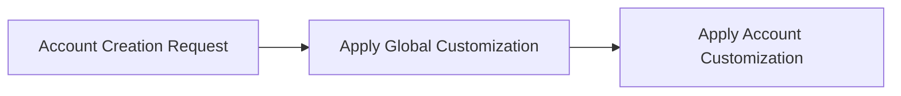
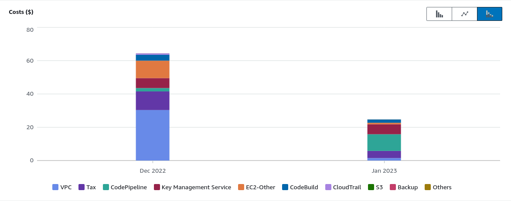

:::info
In this post I'm going to talk about my experience with Control Tower Account Factory for Terraform.
:::

<!--truncate-->

## Summary

[Control Tower Account Factory for Terraform](https://developer.hashicorp.com/terraform/tutorials/aws/aws-control-tower-aft#review-aft-components-and-workflow) is solution aiming to facilitate account creation and governance. You can use it to define what out-of-the-box resources your accounts will have, as well as, add new resources to all the enrolled accounts. It is based on the next workflow:



<i><CaptionDocusaurus label="(simplified) Full schema here"  linkIsRelative={false} link="https://developer.hashicorp.com/terraform/tutorials/aws/aws-control-tower-aft#review-aft-components-and-workflow" /></i>


Let's say we want to create an account, here is an example:

```hcl
module "arepabank" {
  source = "./modules/aft-account-request"

  control_tower_parameters = {
    AccountEmail              = "arepabank-dev-aa50424c@outlook.com"
    AccountName               = "arepabank-dev"
  }

  custom_fields                = {
    client        = "arepa"
    env           = "dev"
  }
  account_customizations_name  = "dev"  # you can use this to group account by stage or client
}
```

Then, depending what you have in the global customization repo (example [here](https://github.com/hashicorp/learn-terraform-aft-global-customizations)) you can define resources to be created in ALL the accounts. A use case is to define a role in all the accounts (deployment role), this one can only be assumed by one IAM user (deployment user).

```hcl file=./resources/3/global-customizations/iam.roles.tf
```

<i><CaptionDocusaurus label="Terraform Code in the Global Customization"  linkIsRelative={true} link="posts/aws/control-tower/resources/3/global-customizations/iam.roles.tf" /></i>


Based on the account customization repository (example [here](https://github.com/hashicorp/learn-terraform-aft-account-customizations)) and folder named as the `account_customizations_name` parameter, only the resources defined there will be created. We can use this to create different resources per stage, for example different ec2 instances:

```bash
dev/
  ec2.micro.tf
tst/
  ec2.small.tf
acc/
  ec2.medium.tf
prd/
  ec2.large.tf
```

Each ec2.*.tf file will contain different configuration. 

```hcl
resource "aws_instance" "web" {
  ami           = data.aws_ami.ubuntu.id
  instance_type = "t3.micro"
}
```

<i><CaptionDocusaurus label="ec2.t3.micro.tf" /></i>

## Is it worth it?

For personal projects and ephemeral workloads: No. Let me list the reasons

* There are fixed costs, no matter if you enroll accounts or not. Next are the main ones:
  * VPC Endpoints. In my first two post I had to fork the official repo and add flags to disable them.
  * KMS keys. I also tried to disable it but major changes were required because it was highly coupled with other resources. 
  * Log Archive account costs: Only S3, KMS and AWS Config services. Less than the previous two, 4$ maximum. 
* AWS CodePipelines, CodeBuild and VPC costs are too high for personal projects. There is a `customizations-pipeline` for each account. This means if you want to update all accounts, all pipelines should be executed. I had 12 accounts enrolled and I paid more than 60$ one month. The same work done in the pipelines could be in GitHub workflows as I did in my [previous post](./3-replacing-aws-codepipeline.mdx)




For my personal projects I'm going to look for a custom solution with cost based on usage. 

## References:

* [Starting with Control Tower](https://docs.aws.amazon.com/controltower/latest/userguide/getting-started-with-control-tower.html)
* [control tower user guide](https://docs.aws.amazon.com/controltower/latest/userguide/guardrails.html)

### Git Repositories

