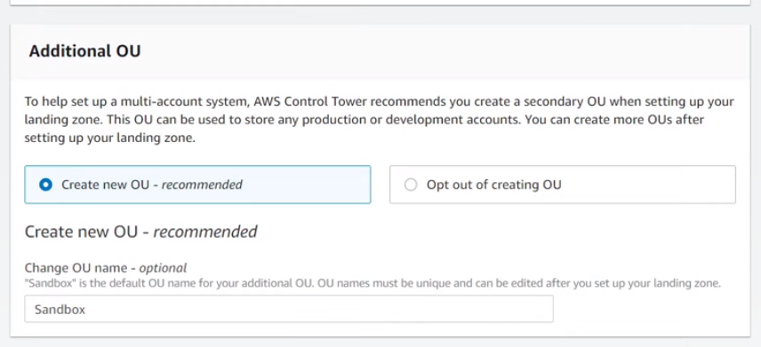

## Problem

After using it for a few days I notice some services deployed where increasing the bill. Those were mainly:

* VPC endpoints
* NAT Trans

in which you initially have to deploy a set of AWS resources to listen for a repository changes and trigger

I did that process I was looking for a way to simplify the AWS accounts creation when I want to start a new project.

## Goal

Create a system that help me setting up new AWS account for any app environment.

## Requirements

The solution should be flexible enough to create AWS account with common settings as: 
* Create default resources
* Add customization, some SSM parameters to describe the account
* Add default policies
* Add a Budget which send notifications in case is about to be exceed (the most important)

## Solution

To use [AWS Control Tower](https://aws.amazon.com/controltower/) and specifically the new feature [Account Factory for Terraform](https://aws.amazon.com/blogs/aws/new-aws-control-tower-account-factory-for-terraform/).

### Before starting following the AFT tutorial

#### Setup AWS Control Tower

Setup AWS Control Tower is easy, it can be done following [this](https://www.youtube.com/watch?v=CwRy0t8nfgM) AWS Video. The only changes I did where:

* Instead of creating a OU named Sandbox, as offered by the Additional OU form:

I named it **Infrastructure** and I will define all my app accounts under it. 

#### OU for your apps

You can create manually the OU for the apps from the AWS CT

# References:

* Youtube Tutorial for setting up AWS Control Tower: [Enable AWS Control Tower for Existing Organizations
](https://www.youtube.com/watch?v=CwRy0t8nfgM)