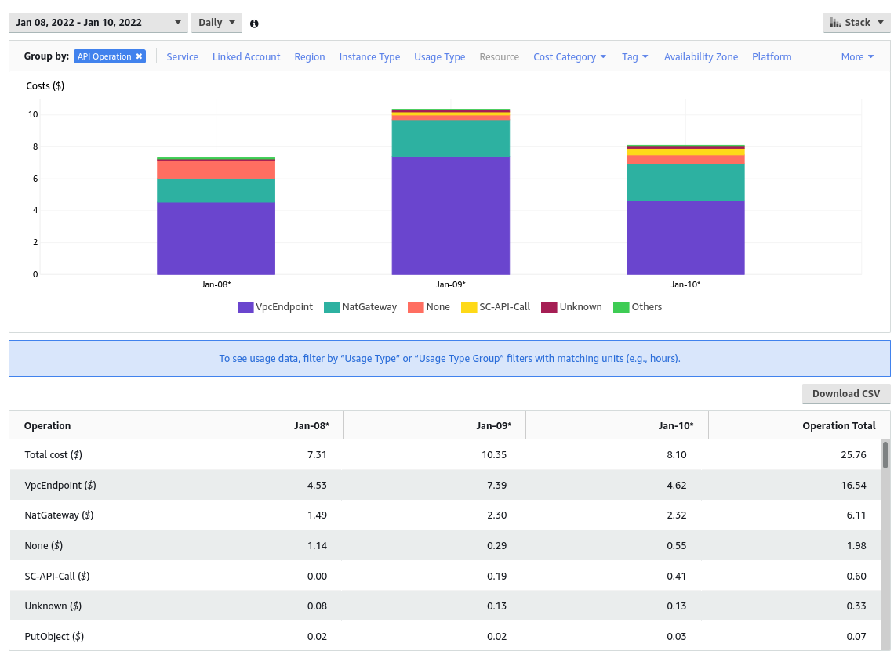
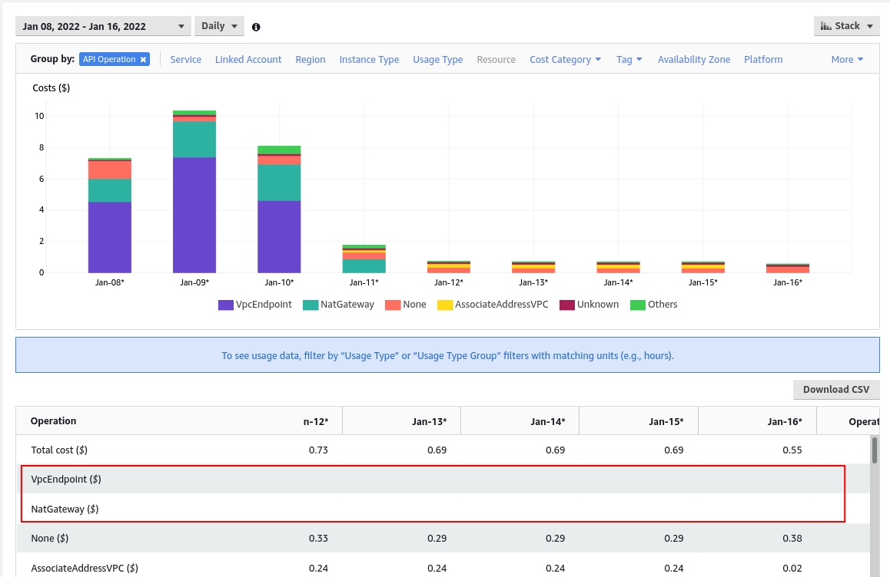

:::info
This post explains some customizations I did to save costs when using AWS Control Tower after I follow the next article: [Manage AWS Accounts Using Control Tower Account Factory for Terraform](https://learn.hashicorp.com/tutorials/terraform/aws-control-tower-aft#create-aws-aft-organizational-unit-and-account). I recommend you read it before continuing. Basic knowledge about AWS and Terraform is required.
:::

<!--truncate-->

## Context

Whenever I want to start a new project, I create an AWS account for each environment, I do it to separate domains and costs. So far, I have been doing this manually, but then I discover the Account Factory for Terraform (AFT) as part of the AWS Control Tower services. 

AFT defines a GitOps process to automatize the account creation and update. It is based on two main elements: 
1. Git repositories where the account creation request and customizations are defined
2. AWS resources that create the account using the settings defined in the repositories. Some of them are CodePipeline, Dynamo tables, Lambdas, and Step Functions.

I don't want to go into details, but I think it is worth mentioning that this automatization simplifies the whole process, not only because we avoid manual operations (that is always nice, right?), but because it allows us to have common customization among different accounts. 

A customization example could be to define a Budget after creating the account. We can add a notification when we are close to a maximum amount (in fact, this was my main goal at first, to avoid any unexpected cost 😁). Next are other examples:

* Create default resources like S3 buckets
* Add SSM parameters to describe the account
* Add custom policies

## Problem: Costs

After using it for a few days, I noticed some AWS resources were increasing the bill. Those were mainly:

1. VPC Endpoints: [billed hourly](https://docs.aws.amazon.com/vpc/latest/privatelink/vpc-endpoints.html).
2. Other resources related to NAT operations

I found it in the Cost Explorer of my root account, grouping by API Operation:



## Solution

### Delete the VPC Endpoints when not used

The AFT repository offers ([terraform-aws-control_tower_account_factory](https://github.com/aws-ia/terraform-aws-control_tower_account_factory)) the flag `aft_vpc_endpoints` to enable/disable the VPC Endpoints. As those are been billed hourly, it doesn't make sense to have them on if you are not using them. So, to save costs, only turn them on before executing an account creation request, and once it is finished, turn them off. The idea is simple, let's see that in practice:

The basic TF code that creates the AFT infrastructure is:

```terraform
module "aft" {
  source                      = "github.com/aws-ia/terraform-aws-control_tower_account_factory"

  ct_management_account_id    = var.ct_management_account_id
  log_archive_account_id      = var.log_archive_account_id
  audit_account_id            = var.audit_account_id
  aft_management_account_id   = var.aft_management_account_id
  ct_home_region              = var.ct_home_region
  tf_backend_secondary_region = "us-west-2"

  vcs_provider                                  = "github"
  account_request_repo_name                     = "${var.github_username}/learn-terraform-aft-account-request"
  global_customizations_repo_name               = "${var.github_username}/learn-terraform-aft-global-customizations"
  account_customizations_repo_name              = "${var.github_username}/learn-terraform-aft-account-customizations"
  account_provisioning_customizations_repo_name = "${var.github_username}/learn-terraform-aft-account-provisioning-customizations"
}
```

Once we have created the infrastructure by executing a `terraform apply`, the VPC endpoints are enabled by default, we process to send the account creation request (explained in the tutorial). Once it is finished, we set the `aft_vpc_endpoints` flag to false:

```terraform {5}
module "aft" {
  source                      = "github.com/aws-ia/terraform-aws-control_tower_account_factory"

  ...

  aft_vpc_endpoints                             = false
}
```

We reexecute `terraform apply` and done! VPC endpoints deleted and costs reduced! 

### Delete the NAT related resources when not used

Maybe, the first approach we think is to manually delete the NAT resources. Then, before queuing any account creation request, we use Terraform to recreate them. That might work, but taking into account that the AFT code is in a GitHub repository, I thought it was better to fork it and add a new flag to conditionally create them. So, I did the next steps:

1. I forked the AWS GH repo [aws-ia/terraform-aws-control_tower_account_factory](https://github.com/aws-ia/terraform-aws-control_tower_account_factory) in [cangulo-aws-aft/terraform-aws-control_tower_account_factory](https://github.com/cangulo-aws-aft/terraform-aws-control_tower_account_factory).
2. I created a new flag called `aft_vpc_nat_gateway` following the `aft_vpc_endpoints` model.
3. I modify the NAT resources to depend on the new flag. 

Everything is done in [this commit](https://github.com/cangulo-aws-aft/terraform-aws-control_tower_account_factory/commit/d8cfd2584f4cec37e1a91d213f823191cec201d3).

Then, I simply update the "aft" module source to my fork and provide the new flag. Next is the result:

```terraform {22}
module "aft" {

  # source = "github.com/cangulo-aws-aft/terraform-aws-control_tower_account_factory"

  # source                      = "github.com/cangulo-aws-aft/terraform-aws-control_tower_account_factory"
  source = "../terraform-aws-control_tower_account_factory"

  ct_management_account_id    = var.ct_management_account_id
  log_archive_account_id      = var.log_archive_account_id
  audit_account_id            = var.audit_account_id
  aft_management_account_id   = var.aft_management_account_id
  ct_home_region              = var.ct_home_region
  tf_backend_secondary_region = var.tf_backend_secondary_region

  vcs_provider                                  = "github"
  account_request_repo_name                     = "${var.github_username}/account-request"
  account_provisioning_customizations_repo_name = "${var.github_username}/account-provisioning-customizations"
  global_customizations_repo_name               = "${var.github_username}/global-customizations"
  account_customizations_repo_name              = "${var.github_username}/account-customizations"

  aft_feature_delete_default_vpcs_enabled = false
  aft_vpc_aws_nat_gateway                 = false
  aft_vpc_endpoints                       = false
}
```

### Reduced Costs



On day 11, I deactivated the VPC Endpoints using the flag explained before, that is why there are still NAT costs. I deactivated it using the forked repository since day 12.

## References:

* Youtube Tutorial for setting up AWS Control Tower: [Enable AWS Control Tower for Existing Organizations](https://www.youtube.com/watch?v=CwRy0t8nfgM)  
* [Manage AWS Accounts Using Control Tower Account Factory for Terraform](https://learn.hashicorp.com/tutorials/terraform/aws-control-tower-aft#create-aws-aft-organizational-unit-and-account)  
* [Account Factory for Terraform](https://aws.amazon.com/blogs/aws/new-aws-control-tower-account-factory-for-terraform/)

### Git Repositories

[learn-terraform-aft-account-provisioning-customizations](https://github.com/hashicorp/learn-terraform-aft-account-provisioning-customizations)  
[learn-terraform-aft-account-customizations](https://github.com/hashicorp/learn-terraform-aft-account-customizations)  
[learn-terraform-aft-global-customizations](https://github.com/hashicorp/learn-terraform-aft-global-customizations)  
[learn-terraform-aft-account-request](https://github.com/hashicorp/learn-terraform-aft-account-request)  