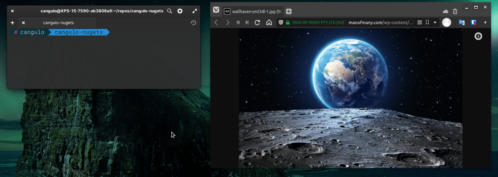

import { CaptionDocusaurus } from '@cangulo-blog/components'
import Gif from '/src/components/gif.js'
import Tabs from '@theme/Tabs'
import TabItem from '@theme/TabItem'

In this post, I will define shortcuts in my bash terminal. The implementation is based on using aliases and functions. Super simple!

<!--truncate-->

## Requirements
* Linux (I'm using [Elementary OS](https://elementary.io), a Ubuntu-based distro, check it!)
* [VS Code](https://code.visualstudio.com). If you don't want to use it, change all the `code` commands in the bash code for your text editor. Alternatives: _gedit_ or [gnome-text-editor](https://gitlab.gnome.org/GNOME/gnome-text-editor).
* Remember to add execution permissions to the scripts through `chmod +x`

## Aliases

You can create **aliases** to avoid type long commands. Next are some examples:


<Tabs>
  <TabItem value="bash" label="bash" default>

```bash file=./code/scripts/aliases-bash.sh#L3-
```
<CaptionDocusaurus label="aliases-bash.sh" linkIsRelative={true} link="posts/bash/2-add-shortcuts/code/scripts/aliases-bash.sh" />

  </TabItem>
  <TabItem value="zsh" label="zsh">

```bash file=./code/scripts/aliases-zsh.sh#L3-
```
<CaptionDocusaurus label="aliases-zsh.sh" linkIsRelative={true} link="posts/bash/2-add-shortcuts/code/scripts/aliases-zsh.sh" />

  </TabItem>
</Tabs>


Please note `$HOME` is an environment variable defined by the system, it refers to your home path, in my case `/home/carlos`.

## Functions

You can also define functions as shortcuts for daily tasks. I have the next ones:

```bash file=./code/scripts/functions.sh
```
_No need to focus on the implementation, I just want to point out some examples._



## How to integrate those shortcuts in the bash terminal?

In order to load the shortcuts every time we open a terminal, we have to append them in the shell profile (`$HOME/.bashrc` for bash terminal, and `$HOME/.zshrc` for zsh). 

However, the profile script will become bigger for every new shortcut we add, to make this extensible we will _source_ ([load](https://linuxize.com/post/bash-source-command/)) the shortcuts from separate scripts. Let me list them:

1. `alias-bash.sh.sh` /  `alias-zsh.sh`
2. `functions.sh`

Append the next code to your profile:

```bash file=./code/sourceScripts.sh
```

<details>
  <summary>Some notes about loading the functions:</summary>

if you want to use the functions in scripts that you call manually from the terminal, you have to `export` them as next:

<Tabs>
  <TabItem value="bash" label="bash" default>

```bash
funcName(){

}
export -f funcName
```

  </TabItem>
  <TabItem value="zsh" label="zsh">

```bash
funcName(){

}
export funcName
```

  </TabItem>
</Tabs>

[reference](https://www.baeldung.com/linux/bash-variables-export)

</details>

Nothing else! I hope this saves you some time using the terminal. Do you have similar shortcuts? Share them in the comments below.


<Gif id="ZVik7pBtu9dNS"  />