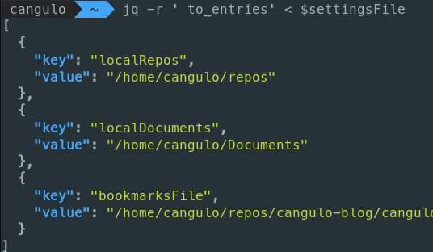

import { CaptionDocusaurus, ShareDocusaurus } from '@cangulo-blog/components'
import Gif from '/src/components/gif.js'
import AboutMe from '@cangulo-blog/components/dist/mdx/aboutme_area.mdx'
import Tabs from '@theme/Tabs'
import TabItem from '@theme/TabItem'

In this post, I will explain how to import custom environment variables from a JSON file. 
I will also improve the shortcuts we create in the previous posts.

<!--truncate-->

## Requirements
* Linux (I'm using [Elementary OS](https://elementary.io), a Ubuntu-based distro, check it!)
* [VS Code](https://code.visualstudio.com). If you don't want to use it, change all the `code` commands in the bash code for your text editor. Alternatives: _gedit_ or [gnome-text-editor](https://gitlab.gnome.org/GNOME/gnome-text-editor).
* [fzf](https://github.com/junegunn/fzf) command-line fuzzy finder

## Notes
* Remember to add execution permissions to the scripts through `chmod +x`
* Profile script: `$HOME/.bashrc` for bash terminal and `$HOME/.zshrc` for zsh 

## Variables

Let's say I want to define some variables as:

* my local github repositories path
* my documents path
* path to a specific file, in this case, the path to a JSON file containing some bookmarks I have, check my [previous post](../1-interactive-bookmarks/1-interactive-bookmarks.mdx)

By defining them in the profile script as:


```bash file=./code/1-declare-vars.sh#L3-
```

We can use them during the terminal session.


Let's append the next function and aliases at the bash profile. Please note those are using the variables defined before.

```bash file=./code/2-add-functions.sh#L3-
```

Now, we can use them after opening the Terminal.


## Behavior vs Configuration

In [a previous post](../1-interactive-bookmarks/1-interactive-bookmarks.mdx), the `listBookmarks` function has the `bookmarksFile` hardcoded. 

```bash file=../1-interactive-bookmarks/code/listbookmarks.sh#L3-L4
```

As you see, its value refers to the `bookmarks.json` location. What happens if we move that file to another folder? We would have to update the function. For one variable this doesn't seem to be a problem, right? But what if it is hardcoded in more functions? we would have to update them all, that is not extensible!

Let's define two terms here:

* Behavior: Functions implementation.
* Configuration: Input parameters that the function relies on. In this case, `bookmarksFile`. 

By setting all the parameters outside the functions, we are creating a central place for the configuration.

```bash file=./code/1-declare-vars.sh#L4-
```

And by calling those from the functions:

```bash file=./code/2-add-functions.sh#L8-L9
```

We are **decoupling** configuration from behavior.  If we want to migrate or share this setup, we won't need to look at the function implementations, we would only need to update the parameters.

<Gif id="d3mlE7uhX8KFgEmY" />

## One extra mile: Define the parameters as JSON

Let's migrate the variables to a JSON file as follows. Please note all the paths are now absolute.

```json file=./code/3-vars.json
```

To set the JSON keys as the parameters name we have to:
1. Define the json file path. We will consider those as the main settings.
2. Use the `jq` command to retrieve the keys and values.
3. Use the `eval` command to execute the `key=value`  for each one.

Next is the solution, replace the variables declaration in your profile for this.

```bash
settingsFile="/home/cangulo/repos/cangulo-blog/cangulo.github.io/blog/posts/bash/3-setup-custom-env-variables/code/3-vars.json"
eval "$(jq -r 'to_entries | .[] | .key + "=" + (.value | @sh)' <$settingsFile)"
```

<details>
  <summary>In case you want to go into the solution details. Click here.</summary>

References:
* Settings json keys as variables`jq`. [Link](https://unix.stackexchange.com/a/413886)
* What `@sh` means in `jq`. Quote string for bash. [Link](https://stedolan.github.io/jq/manual/)

`jq -r 'to_entries'`  structures the json as key/value pair array:



`jq -r 'to_entries | .[]'`  prepare the array items for the iteration:


`jq -r 'to_entries | .[] | .key + "=" + .value'` build the `key=value` expressions 


`jq -r 'to_entries | .[] | .key + "=" + (.value | @sh)'` format the expression


</details>

Nothing more for Today! Do you think this is a good approach? How would you do it? Let me know in the comments below.

<AboutMe/>

<ShareDocusaurus 
  slug="bash/3-load-vars" 
  title="Load custom variables at Terminal startup"
  tags={["linux","productivity","hack","bash","zsh","terminal"]} />