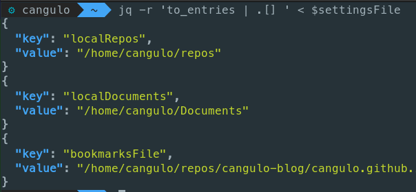

import { CaptionDocusaurus, ShareDocusaurus } from '@cangulo-blog/components'
import Comments from '/src/components/blog/comments.js'
import Gif from '/src/components/gif.js'
import AboutMe from '@cangulo-blog/components/dist/mdx/aboutme_area.mdx'
import Tabs from '@theme/Tabs'
import TabItem from '@theme/TabItem'

In this post, I will explain how to load custom variables by reading a JSON file, this will be done every time we open a Terminal. I will also improve the shortcuts we create in the previous posts.

<!--truncate-->

## Requirements
* Linux (I'm using [Elementary OS](https://elementary.io), a Ubuntu-based distro, check it!)
* [VS Code](https://code.visualstudio.com). If you don't want to use it, change all the `code` commands in the bash code for your text editor. Alternatives: _gedit_ or [gnome-text-editor](https://gitlab.gnome.org/GNOME/gnome-text-editor).
* [fzf](https://github.com/junegunn/fzf) command-line fuzzy finder

## Notes
* Remember to add execution permissions to the scripts through `chmod +x`
* Profile script: `$HOME/.bashrc` for bash terminal and `$HOME/.zshrc` for zsh 

## Variables

Let's say I want to define some variables as:

* my local github repositories path
* my documents path
* path to a specific file, in this case, the path to a JSON file containing some bookmarks I have, check my [previous post](../1-interactive-bookmarks/interactive-bookmarks.mdx)

Then, we define them in the profile script as:


```bash file=./code/1-declare-vars.sh#L3-
```

Now we can use them during the terminal session as well as from any defined function. 


Let's append the next function and alias at the bash profile. Please note those are using the variables defined before.

```bash file=./code/2-add-functions.sh#L3-
```

Now, we can use them after opening the Terminal.


## Behavior vs Configuration

* Behavior: Functions as `listBookmarks`
* Configuration: Parameters as `bookmarksFile` used in the functions.

If we change the bookmarks location, should we change the `listBookmarks` function ? I think not, we should decouple the configuration from the behavior as much as possible, otherwise we depend on hardcoded values along the functions making it hard to maintain. 

On the other hand, I think having a central location for all the parameters is much cleaner, if want to migrate  or share your current setup, you only need to copy the functions and update the parameters. Otherwise, you will have to go function-by-function updating the parameters. 

<Gif id="d3mlE7uhX8KFgEmY"  />

## One extra mile: Define the parameters as JSON

Let's migrate the variables to a json file as follows:


```JSON file=./code/3-vars.json
```

To set the json keys as the parameters name we have to:
1. Define the path to the json file. We will consider those as the main settings. 
2. Use the `jq` command to retrieve the keys and values.
3. Use the `eval` command to execute the `key=value`  for each one.

Next is the solution, replace the variables declaration in your profile for this.

```bash
settingsFile="/home/cangulo/repos/cangulo-blog/cangulo.github.io/blog/posts/bash/3-setup-custom-env-variables/code/3-vars.json"
eval "$(jq -r 'to_entries | .[] | .key + "=" + (.value | @sh)' <$settingsFile)"
```

<details>
  <summary>In case you want to go into details in the solution. Click here.</summary>

References:
* Settings json keys as variables`jq`. [Link](https://unix.stackexchange.com/a/413886)
* What `@sh` means in `jq`. Quote string for bash. [Link](https://stedolan.github.io/jq/manual/)

`jq -r 'to_entries'`  structures the json as key/value pair array:


`jq -r 'to_entries | .[]'`  prepare the array items for the iteration:



`jq -r 'to_entries | .[] | .key + "=" + .value'` build the `key=value` expressions 


`jq -r 'to_entries | .[] | .key + "=" + (.value | @sh)'` format the expression


</details>


<AboutMe/>

<ShareDocusaurus 
  slug="posts/bash/2-add-shortcuts" 
  title="Add shortcuts to your bash terminal"
  tags={["linux","productivity","hack","bash","zsh","terminal"]} />

<Comments />