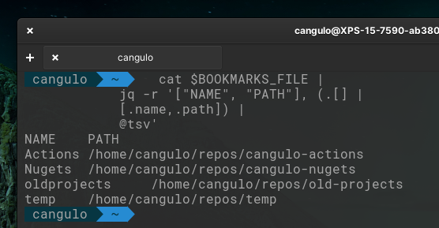
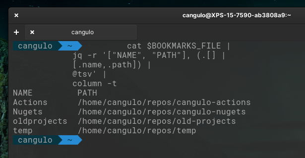
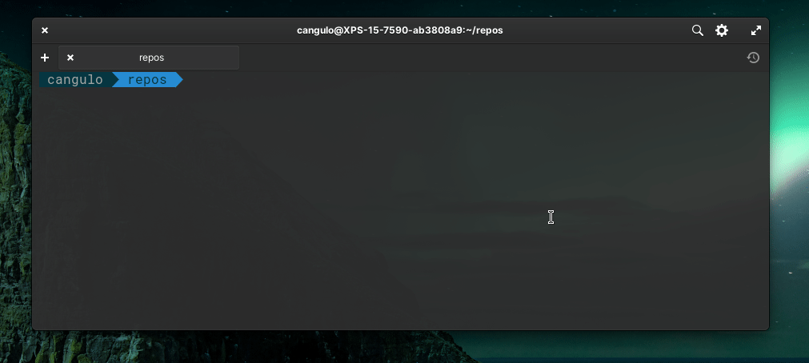
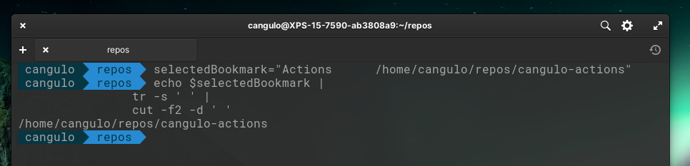
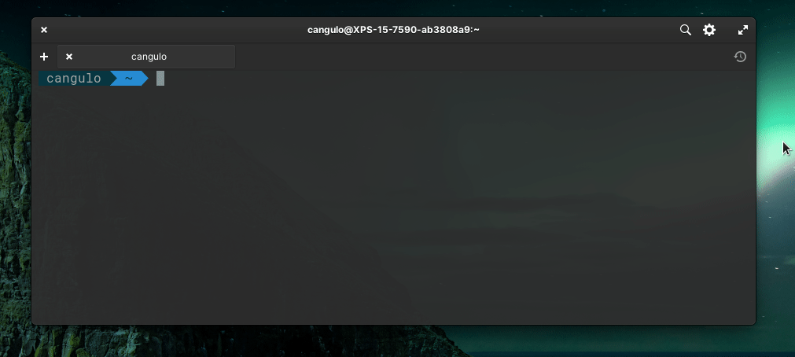

import Gif from '/src/components/gif.js'

In this post, I am going to improve the interactive bookmark I created in a [previous post](../1-interactive-bookmarks/1-interactive-bookmarks.mdx).

<!--truncate-->

## Requirements
* Linux (I'm using [Elementary OS](https://elementary.io), a Ubuntu-based distro, try it!)
* [fzf](https://github.com/junegunn/fzf) command-line fuzzy finder
* Remember to add execution permissions to the scripts through `chmod +x`
* This article improves the interactive bookmark menu implemented in the previous post: [_Create an interactive bookmarks menu in your terminal_](../1-interactive-bookmarks/1-interactive-bookmarks.mdx)

## Improvements introduced

1. Add one directory layer
2. Open VS Code in the repository

### Add one directory layer

I have a global path for all the repositories I clone locally, it is `/home/cangulo/repos`. As I have a lot, I grouped them into folders per organization or custom name.

| Organization/ custom name | Repository                        |
| ------------------------- | --------------------------------- |
| cangulo-actions           | cangulo.nuke.prcommitsvalidations |
| cangulo-actions           | cangulo.nuke.releasecreator       |
| cangulo-actions           | workflows                         |
| cangulo-nugets            | cangulo.changelog                 |
| cangulo-nugets            | cangulo.changelog.github.io       |
| cangulo-nugets            | cangulo.common.testing            |
| old-projects              | cangulo.build                     |
| old-projects              | cangulo.cicd                      |
| old-projects              | cangulo.cicd-gh-action            |
| temps                     | _any temporary repository_        |

The _organization / custom name_ will be the first layer, while the repositories are the second one. Next is the folder structure:

```bash
├── cangulo-actions
│   ├── cangulo.nuke.prcommitsvalidations
│   ├── cangulo.nuke.releasecreator
│   └── workflows
├── cangulo-nugets
│   ├── cangulo.changelog
│   ├── cangulo.changelog.github.io
│   └── cangulo.common.testing
├── old-projects
│   ├── cangulo.build
│   ├── cangulo.cicd
│   └── cangulo.cicd-gh-action
└── temp
    ├── dotnet-docker
    └── gsd
```

### Open VS Code in the repository

Once I choose a repository, I would like to open it using VS Code. 

### Demo


## Implementation

```bash file=./code/listbookmarks.sh#L3- {4-7,12-17}
```

<CaptionDocusaurus label="listBookmarks function" linkIsRelative={true} link="posts/bash/5-interactive-bookmarks-v2/code/listbookmarks.sh" />

Let me write down the changes introduced:

1. Bookmarks now have two properties: _name_ and _path_. 

```json file=code/bookmarks.json#L3-L6
```

* name: string to identify the organization / custom name folder. Without spaces. e.g. for cangulo-actions -> Actions
* path: full path to first layer directories mentioned before.

<details>
  <summary>Full Bookmark file</summary>

```json file=code/bookmarks.json
```

<CaptionDocusaurus label="bookmarks" linkIsRelative={true} link="posts/bash/5-interactive-bookmarks-v2/code/bookmarks.json" />


</details>

2. The path to the bookmarks file is set in the environment variable `$BOOKMARKS_FILE`. We don't have it hardcoded in the function.

```bash file=./code/listbookmarks.sh#L5 {1}
```

3. I now use `jq` to query both attributes `(.[] | [.name,.path])` and output them in the columns `["NAME", "PATH"]`  as a tab-separated-value `@tsv`:

```bash file=./code/listbookmarks.sh#L5-L8
```


Problem: columns are not aligned (see _oldprojects_ row)

4. In order to align the `jq` output before piping it to `fzf`, I use the `column -t` command. [Reference](https://linux.die.net/man/1/column)
```bash file=./code/listbookmarks.sh#L5-L10 {5}
```


5. Once a bookmark is selected, the full row is returned. I



Then, I have to extract the path. First, I delete the repeated spaces (`tr -s ' '`). Secondly, I choose the second column(`cut -f2 -d ' '`). The `-d ' '` parameter is to set columns delimiter to a whitespace.



5. I have created the function `lsf` to list the current directories using `fzf`, navigate to the one selected and execute a command provided as first parameter `$1`. In our case `code`. 

```bash file=./code/listbookmarks.sh#L27-L37 {8}
```

Please note the ` eval "\$command ."` statement for executing the command provided.

## Adding this to your Terminal Profile

You can add this into your Bash / Zsh profile. You can follow the next steps:

1. Define your bookmarks in a json file following the _name,path_ model
2. In your profile, append its path in the `$BOOKMARKS_FILE` variable
3. Append the functions `listBookmarks` and `lsf`.
4. Append a call to the `listBookmarks` function at the end of the profile, so every time you open a terminal it execute it. 

## lsf function

I just want to mention you can use the  `lsf` function separately to make navigation through directories faster. Also, remember it accepts as a parameter a command to execute in the directory selected. Give it a try and add import it in your profile.



## Final Notes

Do you see any other improvement to include? What commands would you provide when using `lsf` ? Share them in the comments below.

<Gif id="UtEUhkfriklonVdweC"  />