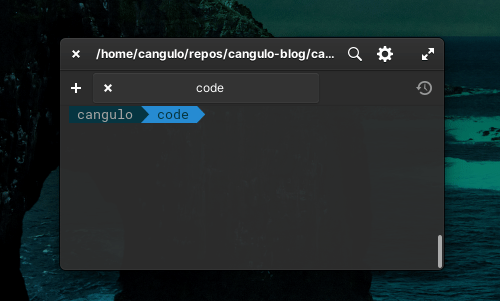
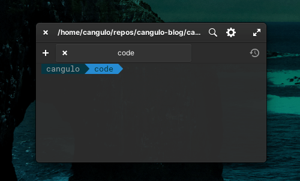

import { CaptionDocusaurus, ShareDocusaurus } from '@cangulo-blog/components'
import Comments from '/src/components/blog/comments.js'
import Gif from '/src/components/gif.js'
import AboutMe from '@cangulo-blog/components/dist/mdx/aboutme_area.mdx'

In this post, I am going to implement an interactive bookmarks menu using fzf.

<!--truncate-->

## Requirements
* Linux (I'm using [Elementary OS](https://elementary.io), a Ubuntu based distro, check it!)
* [fzf](https://github.com/junegunn/fzf) command-line fuzzy finder

## Demo



As you see, every time I call the function `listBookmarks` the following paths are listed interactively. 
* /home/cangulo/repos/cangulo-tf
* /home/cangulo/repos/cangulo-nuke

I can move through them using the up/down keys, and navigate into by pressing Enter.

On the other hand, in case similar paths are listed, I can filter by typing keywords.



## Implementation

```bash file=./code/listbookmarks.sh
```

<CaptionDocusaurus label="listBookmarks function" linkIsRelative={true} link="posts/bash/interactive-bookmarks/code/listbookmarks.sh" />

Let me define the basic structure:
1. Read the paths (let's call them _bookmarks_)
2. List them in a interactive way
3. Once a bookmark is selected, navigate to it

Now let's dive into the details:

### 1. Read the bookmarks
First, in order to make this extensible, the paths are listed in a json file:

```json file=code/bookmarks.json
```

<CaptionDocusaurus label="bookmarks" linkIsRelative={true} link="posts/bash/interactive-bookmarks/code/bookmarks.json" />

We can print the file content using `cat`, and then use `jq` to query the array items. 

`cat $bookmarksFile  | jq -r '.[]'`

<details>
  <summary>If you are asking why I'm using a json file instead of a simple text file. click here for the answer:</summary>

  It is becaus in the next article I will define more advanced bookmarks with different properties used by new features 😁
</details>

### 2. List the bookmarks

Here is where fzf comes up, by piping the bookmarks to fzf, they will be output them as an interactive list.

### 3. Once a bookmark is selected, navigate to it

`fzf` returns the path selected, we save it to a variable.

`local pathSelected=$(cat $bookmarksFile | jq -r '.[]' | fzf)`

We check if it is not empty (`-n`) before moving into:

```bash
if [[ -n "${pathSelected}" ]]; then
    cd $pathSelected
else
    echo "no bookmark selected"
fi
```
## Bonus: execute this every time you open a terminal
You can add this in your bash or zsh profile (_.bashrc_, _.zshrc_ ). Just append the `listBookmarks` implementation, update the `bookmarksFile` variable to be a full path, and call the function.

```bash
listBookmarks() {
    local bookmarksFile='/home/cangulo/repos/FULL_PATH/code/bookmarks.json'
    local pathSelected=$(cat $bookmarksFile |
        jq -r '.[]' |
        fzf)

    if [[ -n "${pathSelected}" ]]; then
        cd $pathSelected
    else
        echo "no bookmark selected"
    fi
}

listBookmarks
```

And that is all! I hope this saves you some time using the terminal. 

<Gif id="xUPOqo6E1XvWXwlCyQ"  />

<AboutMe/>

<ShareDocusaurus 
  slug="posts/bash/interactive-bookmarks" 
  title="Create an interactive bookmarks menu in your terminal"
  tags={["linux", "productivity", "hack", "zsh", "bash", "terminal"]} />

<Comments />