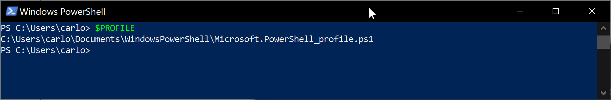
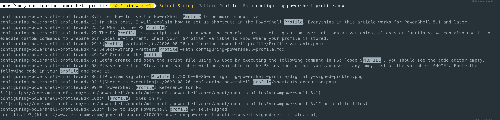
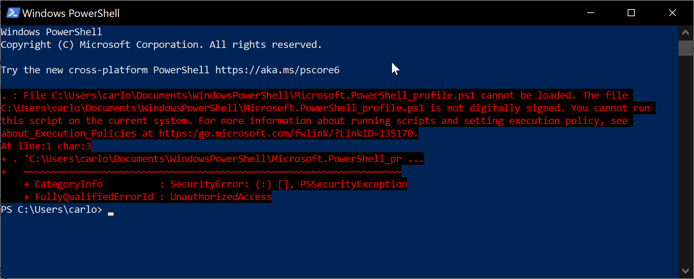
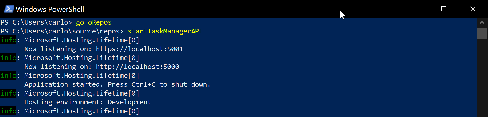

import { CaptionDocusaurus, ShareDocusaurus } from '@cangulo-blog/components'
import Comments from '/src/components/blog/comments.js'
import AboutMe from '@cangulo-blog/components/dist/mdx/aboutme_area.mdx'

In this post, I will explain how to set up shortcuts in the PowerShell Profile. Everything in this article works for PowerShell 5.1 and later.

<!--truncate-->


If you are a PowerShell (a.k.a. PS) user, I'm sure at some point you repeat operations as navigating to a specific folder (e.g. your local GitHub repository). Maybe you run a script to clean or prepare your environment. Let's define those two scenarios as next:

1. Go to your local git repository folder.
   - Code to execute: `cd .\source\repos\`
2. Execute a script.
   - Code to execute: `$HOME\source\repos\TaskManager\startTaskManagerScript.ps1`

## What is the PS Profile?

The PS Profile is a script that is run when the console starts, setting custom user settings as variables, aliases or functions. We can also use it to execute custom commands to prepare our local environment. Check your `$Profile` variable to know where your profile is stored.



## Shortcuts

The shortcuts we are going to set are functions or aliases depending on the following situations:

1. For a command with static parameters, we will write functions. For example, `goToRepos` as a shortcut for `cd $HOME\source\repos`. The code will be:

`function NAME { COMMAND_WITH_PARAMS }` -> `function goToRepos { cd $HOME\source\repos }`

2. We will define an alias for frequently used commands which we call with different parameters. For example, we use `Select-String` to filter file content as next:

```powershell
Select-String [-Pattern] PATTERN [-Path] PATH
```



Instead of writing `Select-String`, we could write `ss`. Next is the alias:

`New-Alias -Name ALIAS -Value COMMAND` -> `New-Alias -Name ss -Value Select-String`

In our case, we want to avoid typing the full _startTaskManagerScript_, so we set that path as COMMAND.

`New-Alias -Name startTaskManagerAPI -Value $HOME\source\repos\TaskManager\startTaskManagerScript.ps1`

### Creating the profile

Let's create and open the PS profile, execute the following command in PS: `code $PROFILE`, you should see the code editor empty. Considering that both commands share the `$HOME\source\repos` path, we could define a variable to short them as next:

```powershell
# Variables

$localRepo = $HOME + '\source\repos'

# Functions

function goToRepos { cd $localRepo }

# Alias

New-Alias -Name startTaskManagerAPI -Value $localRepo\TaskManager\startTaskManagerScript.ps1
```

Please note the `$localrepo` variable will be available during the PS session. This means you can use it anytime, just as the variable `$HOME`. Paste the previous code into your profile and save it.

Open a new PS window. Maybe the next error will show up:



That is because PS has an execution policy that only accepts signed scripts (`AllSigned`). We need to change it to `RemoteSigned` to verify the signature for remote scripts, but not locals. We have to do it using the following command:

`Set-ExecutionPolicy RemoteSigned -Scope CurrentUser`. Now we are good to go, open a new PS and try to execute the shortcuts we defined. 




:::tip use the autocomplete feature!
You don't need to write your aliases or functions completely. Just type the initial part and press `tab`.
:::

And we're done! I hope this helps you to save time when using PS. Do you know any other tweak to be more productive? Feel free to share it in the comments!


## References

* [PowerShell Profiles Reference for PS 5.1](https://docs.microsoft.com/en-us/powershell/module/microsoft.powershell.core/about/about_profiles?view=powershell-5.1)
* [Profiles Files in PS 5.1](https://docs.microsoft.com/en-us/powershell/module/microsoft.powershell.core/about/about_profiles?view=powershell-5.1#the-profile-files)
* [Example 4: Create an alias to an executable file](https://docs.microsoft.com/en-us/powershell/module/microsoft.powershell.utility/set-alias?view=powershell-5.1#example-4--create-an-alias-to-an-executable-file)
* [Example 5: Create an alias for a command with parameters](https://docs.microsoft.com/en-us/powershell/module/microsoft.powershell.utility/set-alias?view=powershell-5.1#example-4--create-an-alias-to-an-executable-file)
* [How to sign PowerShell profile w/ self-signed certificate?](https://www.tenforums.com/general-support/107659-how-sign-powershell-profile-w-self-signed-certificate.html)
* [Signing PowerShell Scripts](https://www.hanselman.com/blog/SigningPowerShellScripts.aspx)


<AboutMe/>

<ShareDocusaurus 
  slug="posts/ps-profile-productive" 
  title="How to use the PowerShell Profile to be more productive" 
  tags={["windows10","productivity","hack","powershell"]} />

<Comments />