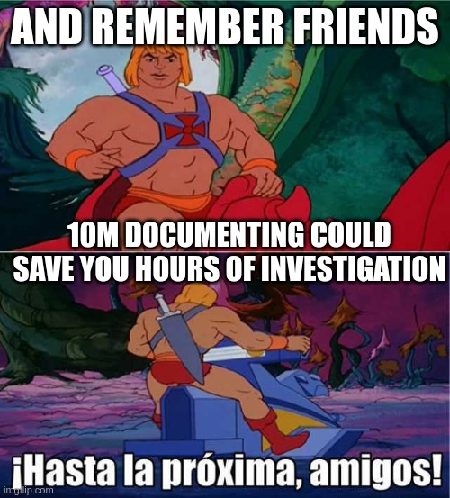

import ShareCard from '/src/components/blog/share.js'
import Caption from '/src/components/blog/caption.js'
import Comments from '/src/components/blog/comments.js'
import AboutMePostArea from '/src/mdx_components/aboutme_area.mdx'

<!--truncate-->

### To document - Definition

Let's make something clear, **to document is not to add comments to your code**. It means, explaining the next point regarding any important development you have done:

* Input -> what we expect
* Output -> what we should return
* Middle steps -> what we do with the input in order to produce an output
* Different scenarios -> The different paths we took when producing the output
* Technical approach decided and the reasons for it -> answer to a future developer which is reading your code or checking the solution, why you took that approach.

It seems a lot but it isn't, you don't to have to write the bible but you have to write the essential to ensure anyone that joins could understand the feature. You want more arguments? Good documentation saves you calls and reduce person dependencies.

:::note **Do you know this programming saying?**  
Always code as if the guy who ends up maintaining your code will be a violent psychopath who knows where you live.
:::

Regarding documentation, I prefer to adapt it as next:

:::tip 
Always document as if the guy who will fix a bug in productions is YOU one year later. Try to make your life easier!
:::

Let's take the next advice from He-man:

<AboutMePostArea/>

## Did you like it? Share it

<ShareCard 
  slug="cheatsheets/git" 
  title="Git Cheatsheet" 
  tags={["git", "githooks", "alias"]} />

<Comments
  slug="cheatsheets/git"  />