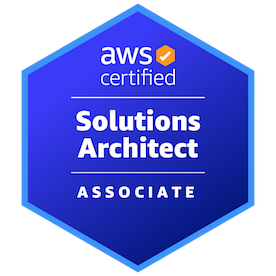

import ExperienceList from './_about/_experience_list.mdx';
import AboutMe from '@cangulo-blog/components/dist/mdx/aboutme_description.mdx'
import Experience from '@cangulo-blog/components/dist/mdx/aboutme_experience.mdx'
import PersonalProject from '@cangulo-blog/components/dist/mdx/aboutme_personal_projects.mdx'
import ProfileImg from '@cangulo-blog/components/dist/mdx/aboutme_profile_img.mdx'
import Contact from '@cangulo-blog/components/dist/mdx/aboutme_contact.mdx'

<AboutMe />
<Experience />
<PersonalProject />
<ProfileImg />
<Contact />
--- 

## Certifications

* AWS Developer Solutions Architect Associate - 2023. [Verification link](https://www.credly.com/badges/e101bbb3-5137-4e53-9968-659bb26f249a/public_url)

* AWS Developer Associate - 2020. [Verification link](https://www.credly.com/badges/80e4c7dd-56c7-451a-8e76-d138e1158e75/public_url)

* Scrum Master - [PUE](https://www.pue.es/cursos/scrum-manager) / Scrum Manager. [Verification link](https://scrummanager.com/website/c/profile/member.php?id=27674)

## Previous Companies

<ExperienceList/>

## Education

* Bachelor's degree in Telecommunications Engineering. Telematic Systems Specialization. 2012-09 - 2017-06.
  - UPC - Barcelona Tech. [Universitat Politècnica de Catalunya.](https://www.upc.edu/en)
    
    
  - ETSETB - [Escola Tècnica Superior d'Enginyeria de Telecomunicacions de Barcelona](https://telecos.upc.edu/en)
  
    