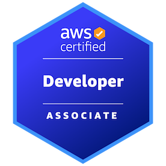
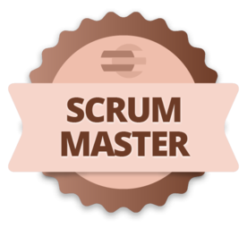

import ExperienceList from './_about/_experience_list.mdx';

# About me

I'm a software engineer with knowledge in backend and frontend. My background is AWS, .NET Core(C#) and SQL, but I also have worked with Angular and React. 

When I was 15 years old, I did the CISCO CCNA 1 certification,  I like that experience so much that I found my path: New Technologies. After, I studied Telecommunication Engineer at UPC. There, I discovered how much I like coding. In order to follow this passion,  I choose Telematics as the last years' specialization. 

I usually say "I love challenges", any of them is an opportunity to learn and grow, that is my way of seeing life. 

LinkedIn   - [Carlos Angulo Mascarell](https://www.linkedin.com/in/angulomascarell)  
Twitter   - [@AnguloMascarell](https://twitter.com/angulomascarell)  
GitHub   - [Carlos Angulo Mascarell - cangulo](https://github.com/cangulo)

Per aspera ad astra.

--- 

## Certifications

* AWS Developer Associate on 2020. [Verification link](https://www.credly.com/badges/80e4c7dd-56c7-451a-8e76-d138e1158e75/public_url)

* Scrum Master - [PUE](https://www.pue.es/cursos/scrum-manager) / Scrum Manager. [Verification link](https://scrummanager.com/website/c/profile/member.php?id=27674)

## Education

* Bachelor's degree in Telecommunications Engineering. Telematic Systems Specialization. 2012-09 - 2017-06.
  - UPC - Barcelona Tech. [Universitat Politècnica de Catalunya.](https://www.upc.edu/en)
    
    
  - ETSETB - [Escola Tècnica Superior d'Enginyeria de Telecomunicacions de Barcelona](https://telecos.upc.edu/en)
  
    

## Experience

<ExperienceList/>