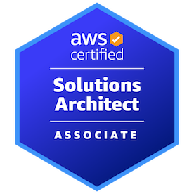
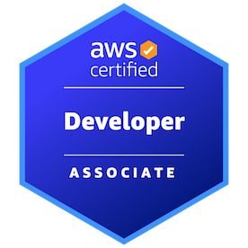
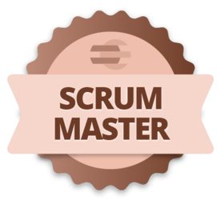

# About me

I'm Carlos Angulo Mascarell, a software engineer based in Barcelona. I write here about
DevOps, AWS, and programming.

You can find me on [LinkedIn](https://www.linkedin.com/in/angulomascarell/) and
[GitHub](https://github.com/cangulo).

---

## Certifications

* AWS Developer Solutions Architect Associate - 2023. [Verification link](https://www.credly.com/badges/e101bbb3-5137-4e53-9968-659bb26f249a/public_url)

* AWS Developer Associate - 2020. [Verification link](https://www.credly.com/badges/80e4c7dd-56c7-451a-8e76-d138e1158e75/public_url)

* Scrum Master - [PUE](https://www.pue.es/cursos/scrum-manager) / Scrum Manager. [Verification link](https://scrummanager.com/website/c/profile/member.php?id=27674)

